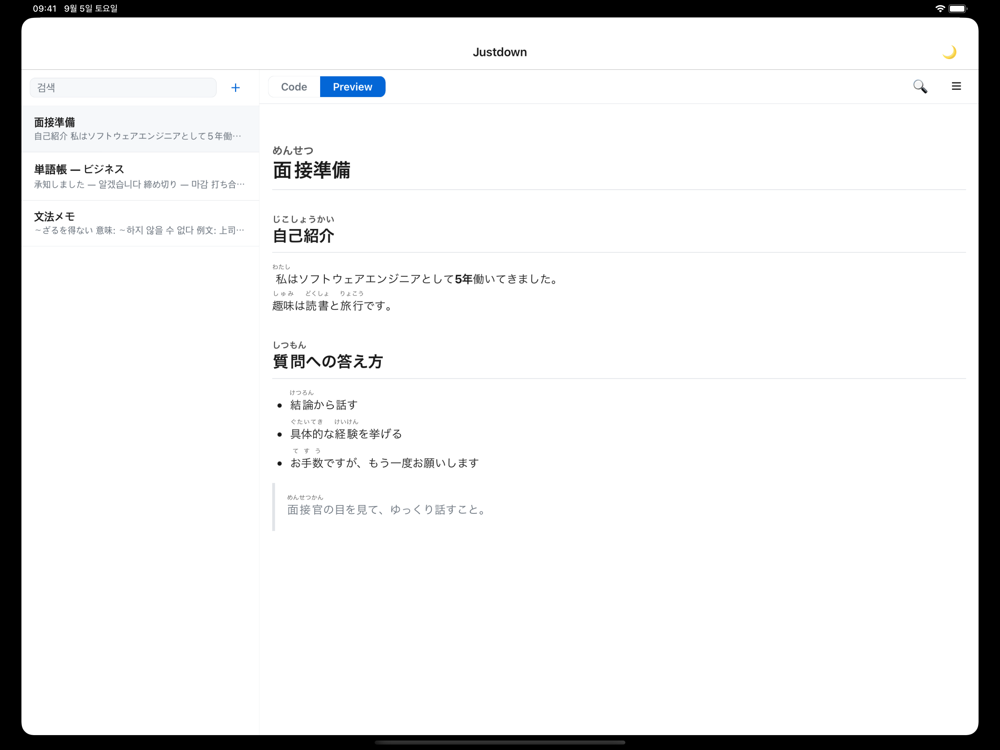
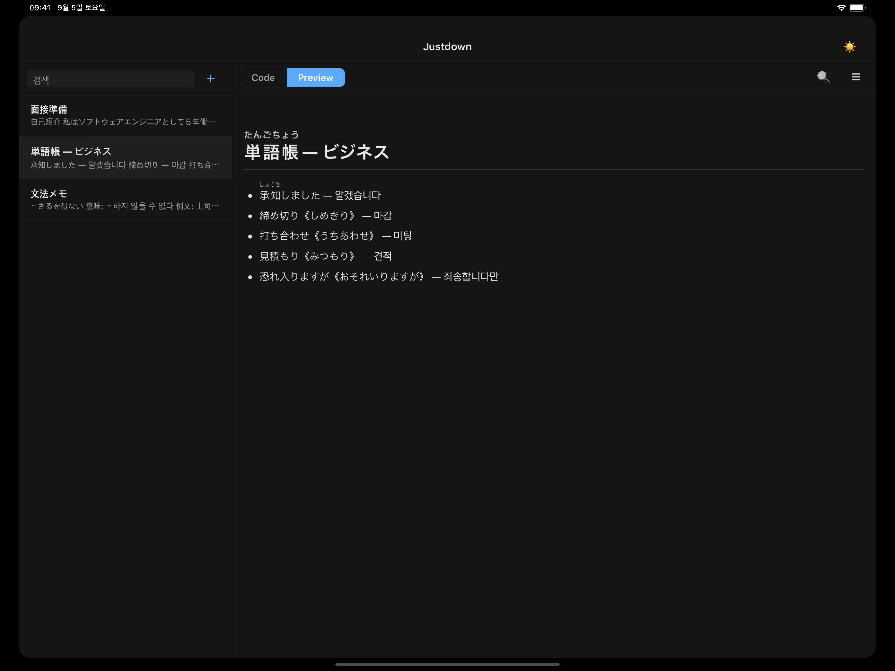

# Justdown

일본어 학습에 특화된 후리가나 마크다운 노트 앱 — 서버·계정 없이 모든 데이터를 기기에만 저장합니다.

**[App Store에서 다운로드](https://apps.apple.com/kr/app/justdown/id6805135080)** · iOS / iPad / macOS(Tauri)



| 다크 모드 | 세로 모드 프리뷰 |
|---|---|
|  |  |

<!-- TODO: screenshot — iPhone 편집 화면 -->
<!-- TODO: screenshot — macOS 데스크톱 앱 -->

## ✨ 핵심 기능

- **후리가나 렌더링** — 아오조라 문고 표기법 `漢字《かんじ》`를 진짜 `<ruby>` 태그로 표시. 일본어 자판에서 치기 어려운 기호는 키보드 툴바로 한 번에 삽입
- **마크다운 편집 + 미리보기** — Code/Preview 탭 전환, highlight.js 코드 구문강조
- **검색** — 노트 목록 전체 검색 + 노트 안 찾기(매치 순환 이동, Code/Preview 양쪽 지원)
- **목차 점프** — 헤딩 아웃라인 패널에서 탭하면 해당 섹션으로 이동
- **자동 저장** — 입력 후 디바운스 저장, 화면 이탈 시 즉시 저장
- **멀티 폼팩터** — iPhone은 리스트→push, iPad 가로·데스크톱은 사이드바 2-pane (단일 코드베이스)
- **3개 언어 + 다크 모드** — 한국어/일본어/영어(시스템 언어 따름), 라이트/다크 테마

## 🛠 기술 스택

| 영역 | 스택 |
|---|---|
| 프레임워크 | Expo SDK 57, React Native 0.86, React 19.2, TypeScript 6.0 |
| 웹/데스크톱 | react-native-web 0.21, Tauri 2.11 (macOS .app/.dmg) |
| 마크다운 | markdown-it 15 (커스텀 후리가나 규칙), highlight.js 11 |
| 저장 | AsyncStorage 2.2 (기기 로컬, 노트당 1키) |
| 다국어 | expo-localization + i18n-js 4.5 |
| 테스트 | Jest 29 (jest-expo) |
| 배포 | EAS Build → App Store / `tauri build` → macOS |

## 📁 구조

```
App.tsx                  네비게이션·테마 컨텍스트, 레이아웃 분기(창 너비+방향)
src/
  markdown.ts            markdown-it 설정 + 후리가나 파서 + 프리뷰 HTML 문서 생성
  storage.ts             노트 CRUD (소프트 삭제 tombstone, 구버전 마이그레이션)
  NoteListPane.tsx       노트 목록 코어 (좁은 화면·2-pane 공용)
  NoteEditPane.tsx       에디터 코어 (탭·툴바·찾기·목차)
  NoteListScreen.tsx     좁은 화면용 목록 래퍼 (네이티브 헤더 검색바)
  NoteEditScreen.tsx     좁은 화면용 편집 래퍼
  TwoPaneScreen.tsx      와이드 모드 사이드바+에디터, 데스크톱 단축키
  MarkdownPreview.tsx    프리뷰 — 네이티브(WebView) / 웹(iframe) 플랫폼 분기
  i18n.ts, locales/      ko·ja·en 로케일
  theme.ts               라이트/다크 팔레트
  __tests__/             단위 테스트 (markdown·storage·i18n)
src-tauri/               macOS 데스크톱 래퍼 (Rust, Tauri 2)
```

## 🔍 기술적으로 신경 쓴 점

- **후리가나 파서를 markdown-it core rule로 구현** — inline 파싱이 끝난 뒤 text 토큰만 변환하므로 코드 블록/인라인 코드 안의 `《》`는 건드리지 않고, 인용부호 `「」『』`와도 충돌하지 않음
- **단일 코드베이스 멀티 폼팩터** — 화면을 Pane(코어)과 Screen(래퍼)으로 분리하고, 플랫폼이 아닌 창 너비+방향 기준으로 레이아웃을 분기. iPhone/iPad 회전/브라우저 리사이즈/macOS 창이 같은 규칙으로 동작
- **테마 전환 시 프리뷰 문서를 재생성하지 않음** — CSS 변수로 양 테마를 한 문서에 담고 클래스만 전환. WebView/iframe 리로드로 스크롤 위치가 소실되는 문제를 구조적으로 제거
- **동기화를 대비한 저장 계층** — 삭제는 tombstone(소프트 삭제)으로 기록하고, 자동 저장은 미저장 변경이 있을 때만 flush해서 `updatedAt` 정렬 순서를 보존. 삭제된 노트는 자동 저장으로 부활하지 않도록 저장 계층에서 차단
- **엔진별 렌더링·이벤트 차이 대응** — WKWebView(Tauri/Safari)에서만 드러난 버그들을 Playwright WebKit으로 재현해 수정 (전역 단축키는 capture 단계 등록으로 react-native-web TextInput의 stopPropagation 우회 등)

## 🚀 로컬 실행

```bash
npm install
npx expo start        # i = iOS 시뮬레이터, w = 웹
```

macOS 데스크톱 앱 (Rust 툴체인 필요):

```bash
npx tauri dev         # 개발 실행
npx tauri build       # .app / .dmg 빌드
```

필요한 환경변수 없음 — 네트워크 통신이 없는 로컬 전용 앱입니다.

## ✅ 테스트

```bash
npm test              # Jest 단위 테스트
npm run typecheck     # tsc --noEmit
npm run lint          # expo lint
```

---

Claude Code를 활용한 1인 개발 프로젝트입니다 — 아키텍처, 데이터 모델, 기술 선택은 직접 결정했습니다.
개발 과정의 상세 문서(후리가나 문법, 데이터 모델, 트러블슈팅 이력)는 [docs/DEVELOPMENT.md](docs/DEVELOPMENT.md)에 있습니다.
